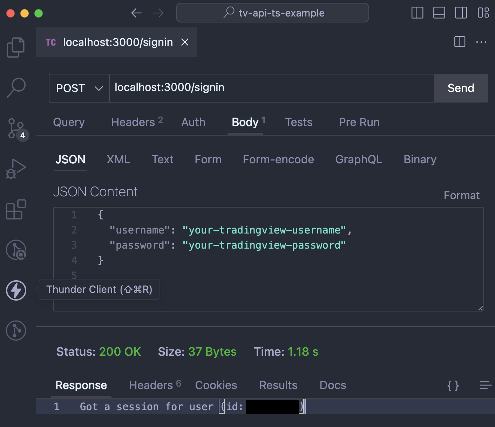

# Overview

### Example in JavaScript

https://github.com/Mathieu2301/TradingView-API/blob/401936ff371fe6281938b7fb2d2e4580c7c7fc3f/examples/SimpleChart.js

### Goals of this example

1. [x] signing into TradingView from express server
2. [ ] getting OHCD data for EURUSD from express server
3. [ ] refactor TradingViewAPI code that does the above to TypeScript

# How to run

```
$ nvm use
$ npm install
$ node index.js
```

# Signing in

- Method: POST
- Request JSON Payload

```
{
  "username": "your-tv-username",
  "password": "your-tv-password"
}
```

- Response will be either
  - HTTP 200 with a text message or
  - HTTP 400 with a BAD_REQUEST error
    - Details of the error will be on your console

Screenshot below for reference

I'm using Thunder Client VSCode extension



# References

- https://github.com/Mathieu2301/TradingView-API/tree/main
- https://blog.logrocket.com/how-to-set-up-node-typescript-express/

# About me / reaching out

If you liked this example and would like me to make others similar to it feel free to reach out

If you sponsor me, your request will get my attention quicker as I check the sponsor dashboard from time to time

On telegram you can find me with the same tag as GitHub: https://t.me/clins777
